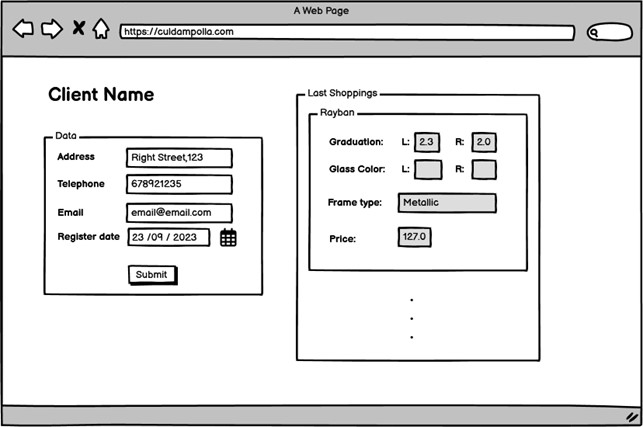

# Assignment Instructions
Imagine that we have the following graphical interface, from the point of view of an Optical Store customer.

How would you design the database that facilitates information?